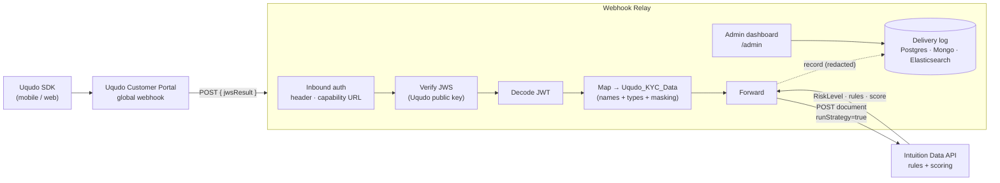

# Uqudo → Intuition Webhook Relay

A small, stateless service that turns the **Uqudo customer-portal webhook** into
**Intuition Data API** documents.

Uqudo posts a signed JWT (`jwsResult`) after every completed onboarding session.
Intuition wants a `Uqudo_KYC_Data` document with specific field names and types.
The two don't match — so this relay sits between them: it **verifies** the
signature, **decodes** the JWT, **maps** ~40 fields into the dataset schema, and
**forwards** the document (running the rules strategy). Every delivery is logged
to a durable store and surfaced on a built-in admin dashboard.

Runs three ways from one codebase: a **Vercel** function, a **Docker** container,
or a plain Node process.



Full design, sequence diagrams, and the deployment topology are in
[`docs/ARCHITECTURE.md`](docs/ARCHITECTURE.md).

**Documentation**

| Doc | What it covers |
|---|---|
| [docs/INSTALLATION.md](docs/INSTALLATION.md) | Installation & implementation guide — deployment modes (Vercel / Docker / HA), **backend selector (Postgres · MongoDB · Elasticsearch)**, portal wiring, verification, operations |
| [docs/ARCHITECTURE.md](docs/ARCHITECTURE.md) | Illustrated architecture — every component explained with 12 diagrams |
| [docs/WEBHOOK-SETUP.md](docs/WEBHOOK-SETUP.md) | Placing the webhook in the Uqudo Customer Portal, step by step |

---

## Why a relay (and not the portal → Intuition directly)?

The portal only sends `{ "jwsResult": "<signed JWT>" }`. Intuition rejects that —
it needs a `customer_number`, `verification_timestamp`, `personalInfo[]`,
`DeviceAttestation[]`, etc. The relay does five things that neither side will:

1. **Verify** the JWS signature against Uqudo's public key (fail-closed).
2. **Decode** the JWT — the data Intuition wants is base64 inside it.
3. **Map** it to the exact `Uqudo_KYC_Data` field names **and types** (e.g.
   `face_match_level` is a String, `GPSLocation_latitude` a Number — a mismatch
   is a 400). Direct KYC identifiers are masked before anything is logged.
4. **Stamp** client identity and forward with `runStrategy=true` so rules fire.
5. **Translate the response**: `2xx` so Uqudo stops retrying, `502` on a
   transient failure so it *does* retry, `400` on malformed input so it doesn't.

---

## Quick start

### Docker (single node)

```bash
cp .env.example .env          # fill in Intuition target + secrets
docker compose up -d --build  # relay + Postgres
open http://localhost:8080/admin
```

### Docker (high availability)

```bash
cd deploy
cp ../.env.example .env
docker compose -f docker-compose.ha.yml up -d --build            # nginx + 3 relay replicas + Postgres
docker compose -f docker-compose.ha.yml up -d --scale relay=6     # scale out
```

### Vercel

```bash
vercel --prod
# then set env vars in the dashboard (Intuition target, ADMIN_PASSWORD, inbound secret),
# and attach a Postgres (Storage → Neon) — it injects DATABASE_URL automatically.
```

---

## Configuration

Everything is environment-driven — see [`.env.example`](.env.example). The
essentials:

| Variable | Purpose |
|---|---|
| `INTUITION_BASE_URL` / `INTUITION_TENANT_ID` / `INTUITION_DATASET_ID` | **Required.** Where documents are forwarded. |
| `UQUDO_PUBLIC_KEY` | PEM key to verify the JWS. Without it the relay refuses to forward unless `ALLOW_UNVERIFIED=true`. |
| `WEBHOOK_AUTH_VALUE` | Shared secret for the `x-api-key` header. |
| `WEBHOOK_URL_TOKEN` | Secret path token for the capability-URL style (`/api/uqudo-webhook/<token>`). |
| `LOG_STORE` | `memory` \| `postgres` \| `mongo` \| `elasticsearch` (inferred from the connection URL if unset). |
| `DATABASE_URL` / `MONGO_URL` / `ELASTICSEARCH_URL` | Connection string for the chosen backend. |
| `ADMIN_PASSWORD` | Enables the dashboard. Unset ⇒ dashboard disabled (fail-closed). |
| `LOG_PAYLOADS` | Capture the decoded JWT + mapped doc (masked) for debugging. Off by default. |

### Delivery-log backends

The log is a pluggable driver — pick one, the relay **auto-creates** its table /
collection / index on first use (no migration step):

| `LOG_STORE` | Backend | Notes |
|---|---|---|
| `memory` | in-process ring buffer | Default. Complete when self-hosted; **partial on serverless** (per-instance). |
| `postgres` | PostgreSQL | Works with Neon, Vercel Postgres, RDS, Supabase (pooled), or the bundled container. |
| `mongo` | MongoDB | One document per delivery. |
| `elasticsearch` | Elasticsearch 8 | One index; forces a refresh on write so reads are immediate. |

All durable drivers support the same filters (result, free-text search, time
range) and are covered by tests that run against a **real** database.

---

## The admin dashboard (`/admin`)

Password-gated (HMAC-signed httpOnly cookie; fail-closed when `ADMIN_PASSWORD`
is unset). Shows request volume, forwarded/failed counts, success rate and
latency percentiles, a 24h/7d/30d activity chart, top rules triggered, and a
searchable request log. Each delivery opens a drawer with stage timings
(verify → map → forward), the triggered rules **with their descriptions**, and —
when `LOG_PAYLOADS=true` — the masked JWT and mapped document.

---

## Placing the webhook in the Uqudo portal

Step-by-step in [`docs/WEBHOOK-SETUP.md`](docs/WEBHOOK-SETUP.md). In short: in the
portal under **Development → Webhook**, set the URL to your relay's
`/api/uqudo-webhook` endpoint and either add an `x-api-key` custom header, or use
the capability-URL form (`/api/uqudo-webhook/<token>`) with auth = None.

---

## Development & testing

```bash
npm install
npm start                 # http://localhost:8080
npm test                  # all suites (durable-DB suites skip if no DB is up)
npm run test:pg           # spin up Postgres in Docker and run its suite
npm run test:mongo        # same for MongoDB
npm run test:es           # same for Elasticsearch
```

Tests exercise the JWS verify/decode/map chain, PII redaction, admin auth,
inbound auth (both styles), and every storage driver against a real database.

---

## Security posture

- **JWS verification** is the gate on authenticity — enable it in production.
- **Inbound auth** (header secret or capability-URL token) stops anyone who
  learns the URL from injecting documents.
- **PII**: direct identifiers (names, ID/passport numbers, DOB) are masked before
  logging; image blobs are dropped. Full payload capture is opt-in and still masks.
- **Admin dashboard** fails closed and uses timing-safe comparisons.
- The container runs **non-root** with a healthcheck.

## License

MIT.
