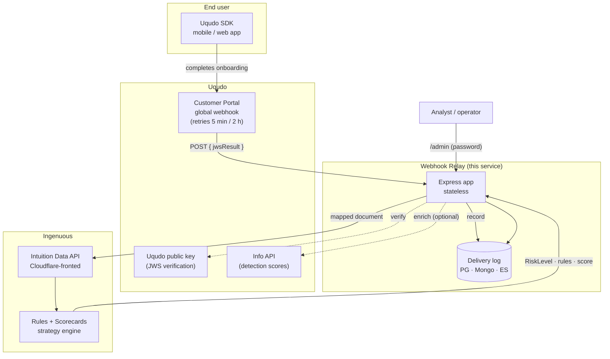
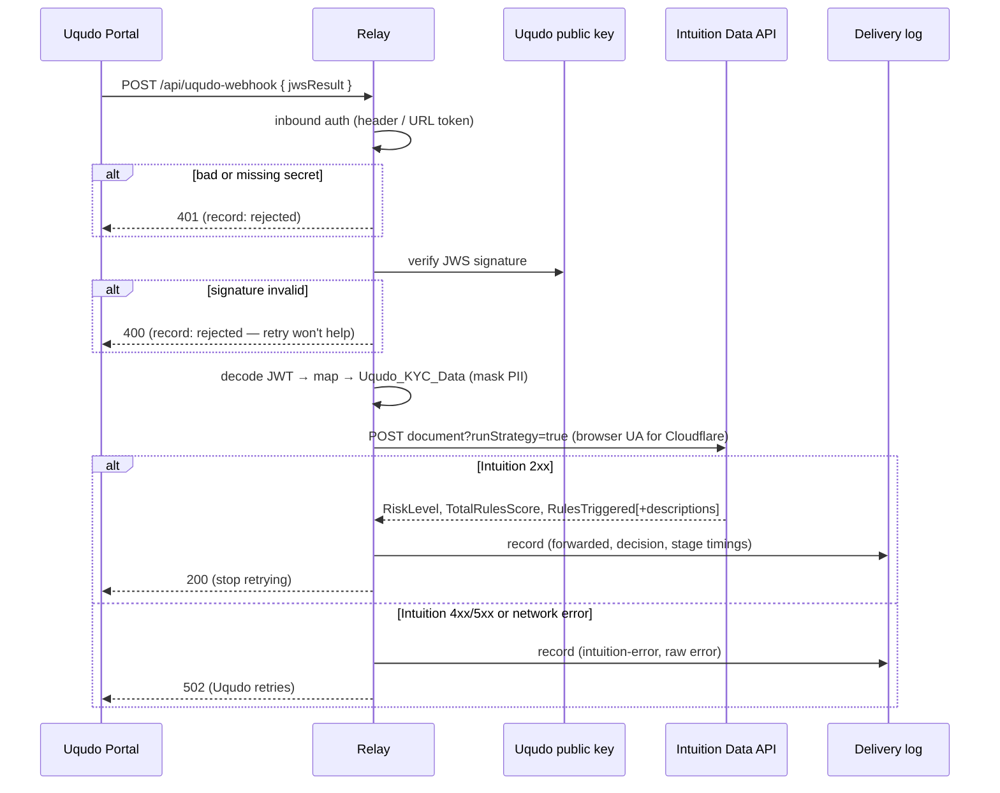
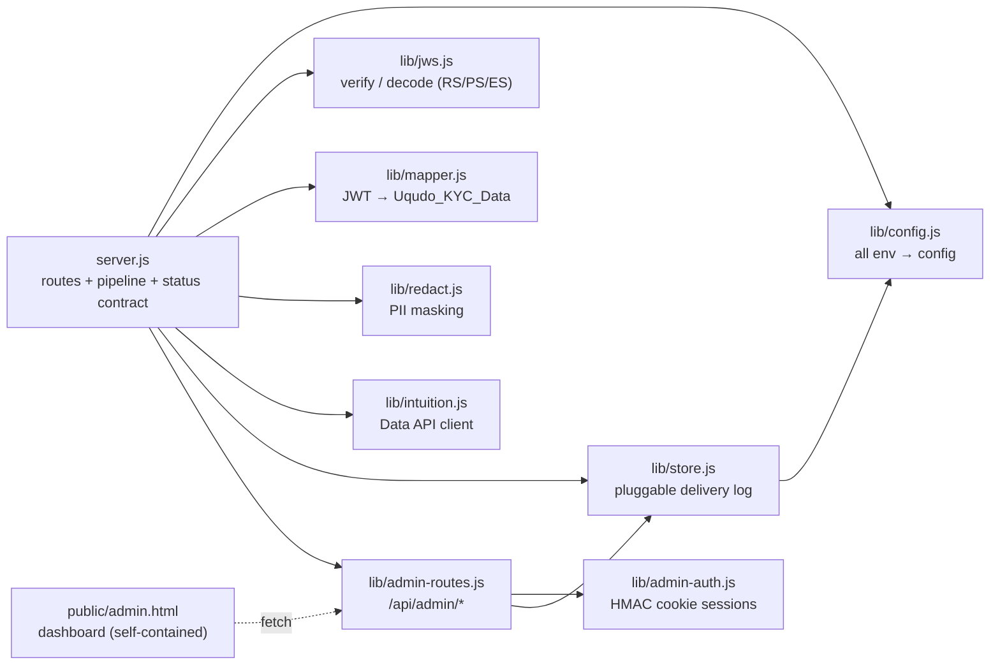
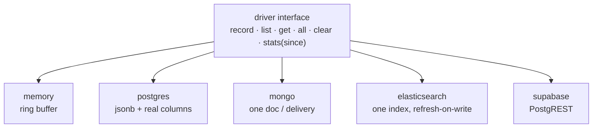
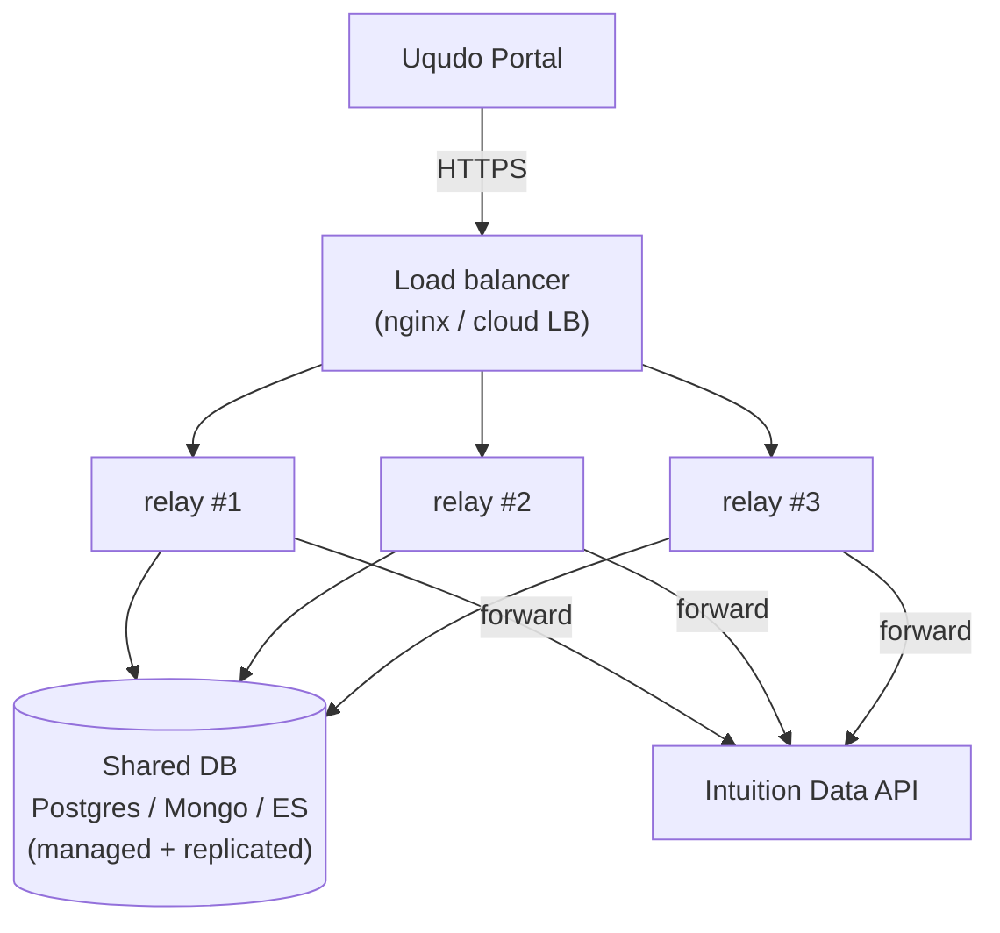

# Architecture

The relay is a **stateless transformer** between two systems that speak
different languages: the Uqudo customer-portal webhook (a signed JWT) and the
Intuition Data API (a typed `Uqudo_KYC_Data` document). All durable state lives
in an external delivery-log database, which is what makes the service horizontally
scalable.

---

## 1. System context



---

## 2. Request lifecycle

Every webhook delivery flows through the same pipeline. Failures short-circuit
to a status code chosen so Uqudo's retry behaviour does the right thing.



**Status-code contract**

| Situation | Returned to Uqudo | Why |
|---|---|---|
| Mapped & forwarded OK | `200` | Done — stop retrying. |
| Bad/missing inbound secret, malformed body, invalid JWS | `400` / `401` | Retrying won't fix it. |
| Intuition rejected or unreachable | `502` | Transient — let Uqudo retry (5 min, up to 2 h). |

---

## 3. Module map



Two structural traps the mapper handles (both have bitten real integrations):

- **Documents** live at `data.documents[]`, but **device attestation** is at the
  JWT's **top level** — not inside `data`.
- The dataset field **name** is `deviceIdentifier`; `deviceIdentifier-UqudoShield`
  is only its portal **label**. Sending the label uploads cleanly (200) but leaves
  device fields empty, so device rules silently never fire.

---

## 4. Delivery-log storage (pluggable)

One driver interface, four implementations. `lib/store.js` selects one from
`LOG_STORE` (or infers it from whichever connection URL is set) and **falls back
to memory** if a durable store is misconfigured — dropping a KYC delivery to
protect a debug log would be the wrong trade, and the dashboard shows which
driver is actually live.



Common guarantees across the durable drivers:

- **Auto-migration** — table / collection / index created on first write.
- **Idempotent writes** — a webhook retry with the same id is a no-op
  (`ON CONFLICT` / duplicate-key / `op_type=create`).
- **Injection-safe** filtering — search input is always a bound parameter or a
  structured query value, never string-concatenated.
- **Time-range** filters (`since`) for the dashboard's 24h / 7d / 30d views.

Each is tested against a **real** database (`npm run test:pg|test:mongo|test:es`).

### Record shape (redacted)

Only non-identifying fields are stored by default. Direct identifiers are masked,
image blobs dropped. Illustrative document:

```json
{
  "id": "a3e89eebb55a",
  "at": "2026-07-19T02:08:54Z",
  "result": "forwarded",
  "verified": true,
  "verification_id": "sess-abc-123",
  "customer_number": "784199912345678",
  "riskLevel": "Suspicious",
  "totalRulesScore": 170,
  "rulesTriggered": ["MA_EM", "UQ_DA_R8", "MA_PH", "MA_DE", "PEP_SIMILAR"],
  "rulesDescriptions": ["...", "...", "...", "...", "..."],
  "stages": { "verifyMs": 1, "mapMs": 2, "forwardMs": 540 },
  "authVia": "url-token",
  "durationMs": 543
}
```

---

## 5. Deployment topology (high availability)

The app is stateless, so HA is "run N replicas behind a load balancer, all
sharing one database." A dead replica is skipped by the LB and restarted by the
orchestrator; no session or delivery state is lost because none lives in the app.



- **`deploy/docker-compose.ha.yml`** runs exactly this (nginx + N relay replicas
  + Postgres) for a single-host HA demo.
- For production, put the relay behind a cloud LB (or Kubernetes `Deployment` +
  `Service` + `HorizontalPodAutoscaler`), point `DATABASE_URL` /
  `MONGO_URL` / `ELASTICSEARCH_URL` at a **managed, replicated** datastore, and
  set a shared `ADMIN_SESSION_SECRET`.
- On **serverless (Vercel)** each invocation is its own instance, so a durable
  store is mandatory — the in-memory log is per-instance and reads would be
  partial.

### Scaling notes

| Concern | Handling |
|---|---|
| Statelessness | All state in the DB; replicas are interchangeable. |
| DB connections | Serverless sets a small pool (`PG_POOL_MAX=1`) and expects a **pooled** endpoint (pgbouncer / Neon pooled). |
| Idempotency | Same-id retries are no-ops, so Uqudo's retries can't double-count. |
| Health | `/healthz` gates LB traffic and restarts. |
| Back-pressure | Forward has a bounded timeout; failures return `502` so Uqudo retries rather than the relay blocking. |
