# Architecture — Illustrated

The relay is a **stateless transformer** between two systems that speak
different languages: the Uqudo customer-portal webhook (a signed JWT) and the
Intuition Data API (a typed `Uqudo_KYC_Data` document). All durable state lives
in an external delivery-log database, which is what makes the service
horizontally scalable.

This document explains every component with diagrams. For install steps see
[INSTALLATION.md](INSTALLATION.md).

**Contents**
1. [System context](#1-system-context)
2. [Request lifecycle](#2-request-lifecycle)
3. [Inbound authentication](#3-inbound-authentication)
4. [Info API enrichment](#4-info-api-enrichment)
5. [Data mapping — JWT → Uqudo_KYC_Data](#5-data-mapping)
6. [Delivery states & status-code contract](#6-delivery-states)
7. [Module map](#7-module-map)
8. [Delivery-log storage (pluggable)](#8-delivery-log-storage)
9. [Admin dashboard](#9-admin-dashboard)
10. [Runtime settings across instances](#10-runtime-settings)
11. [Security model](#11-security-model)
12. [Deployment topology & HA](#12-deployment-topology)

---

## 1. System context

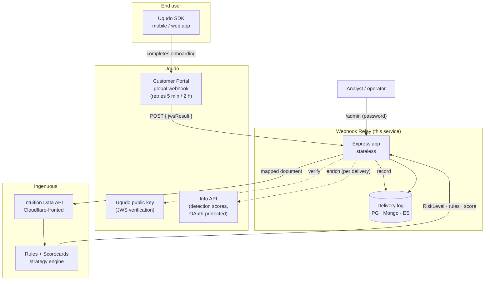

Why a relay at all: the portal can only POST `{"jwsResult": "<JWT>"}` to a URL,
and Intuition only accepts a typed `Uqudo_KYC_Data` document with a
`customer_number` primary key. Posting the webhook body straight at Intuition
returns `PropertyRequired: #/customer_number` — the two shapes share nothing.
Someone must verify, decode, enrich, map and translate error semantics. That is
the relay's entire job.

---

## 2. Request lifecycle

Every webhook delivery flows through one pipeline; each stage is individually
timed and recorded (`stages.verifyMs / enrichMs / mapMs / forwardMs`).

```mermaid
sequenceDiagram
  participant P as Uqudo Portal
  participant R as Relay
  participant U as Uqudo (key / Info API)
  participant I as Intuition Data API
  participant D as Delivery log

  P->>R: POST /api/uqudo-webhook { jwsResult }
  R->>R: 1 inbound auth (header / URL token)
  alt bad or missing secret
    R-->>P: 401 (record: rejected)
  end
  R->>U: 2 verify JWS signature
  alt signature invalid
    R-->>P: 400 (record: rejected — retry won't help)
  end
  R->>U: 3 enrich — Info API (best-effort, timed)
  Note over R,U: detection scores are NOT in the JWT;<br/>Info API data expires, so fetch happens now
  R->>R: 4 map JWT (+ enrichment) → Uqudo_KYC_Data
  R->>I: 5 POST document?runStrategy=true (browser UA for Cloudflare)
  alt Intuition 2xx
    I-->>R: RiskLevel, TotalRulesScore, RulesTriggered + RulesDescriptions
    R->>D: record (forwarded, decision, stage timings, masked payloads*)
    R-->>P: 200 (stop retrying)
  else Intuition 4xx/5xx or network error
    R->>D: record (intuition-error, raw error body)
    R-->>P: 502 (Uqudo retries)
  end
```

\* payload capture only when the runtime toggle is on — see §10.

---

## 3. Inbound authentication

Two interchangeable styles, matching what the portal can send. The decision is
strict — a wrong capability token is **final** and never falls through to the
header check (otherwise the token could be bypassed by supplying the header).

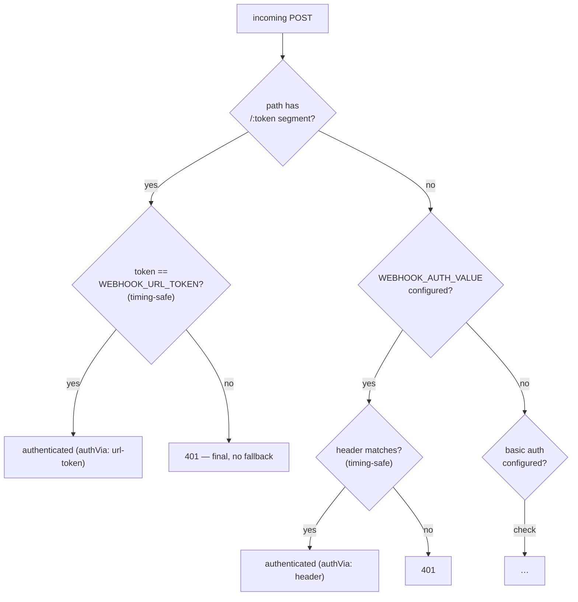

| Style | URL | Portal auth setting | Trade-off |
|---|---|---|---|
| Header secret | `/api/uqudo-webhook` | Custom Headers (`x-api-key`) | secret never in URLs/access logs — **recommended** |
| Capability URL | `/api/uqudo-webhook/<token>` | None | zero portal config; token rides in the path |

All comparisons are constant-time (`crypto.timingSafeEqual`). The auth method
used is recorded per delivery (`authVia`) but the secret itself never is.

---

## 4. Info API enrichment

The webhook JWT does **not** carry fraud-detection scores. They live in Uqudo's
Info API, whose data **expires** — so enrichment happens at delivery time and
cannot be backfilled.

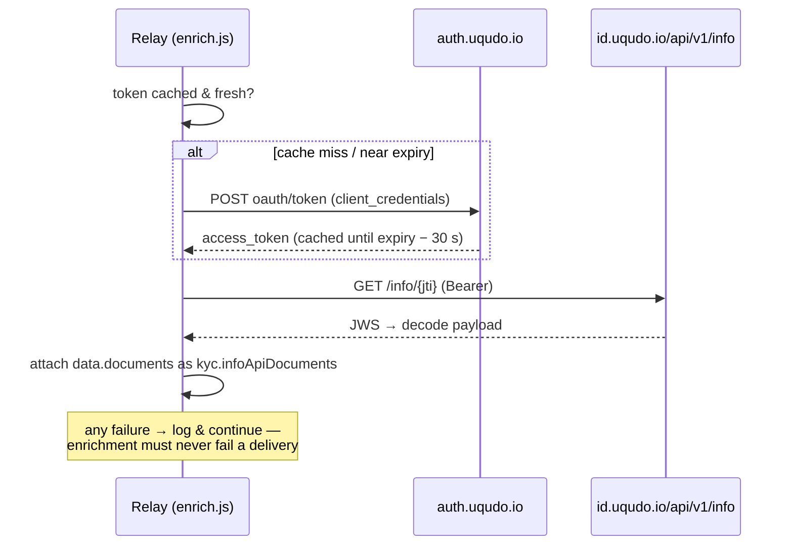

The enriched documents carry `scan.verifications` with the **real key names**:

```
idPrintDetection:          { enabled, score }
idScreenDetection:         { enabled, score }
idPhotoTamperingDetection: { enabled, score }
```

The mapper prefers these over the raw JWT and falls back to legacy bare names.
Note: not every SDK flow produces detection scores — an empty `verifications`
block in *both* the JWT and the Info API means the flow genuinely has none, and
the `FD_*` rules legitimately cannot fire for it.

---

## 5. Data mapping — JWT → Uqudo_KYC_Data <a name="5-data-mapping"></a>

The single highest-risk area of the whole system. The **raw portal JWT** differs
from the app-processed object most sample code is written against — every arrow
below was verified against a captured live delivery.

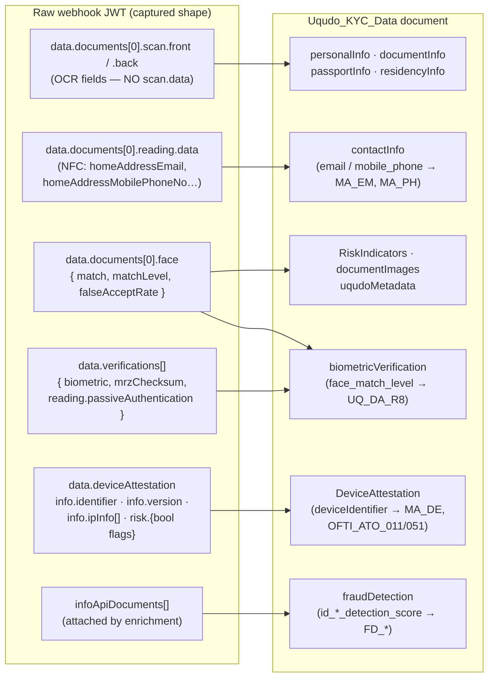

Hard-won mapping facts (each has a regression test):

| Fact | Consequence if missed |
|---|---|
| Device id is `deviceAttestation.info.identifier` (webhook JWT) — `deviceIdentifier` only in app-processed payloads | empty device field → `MA_DE` / `OFTI_ATO_011/051` never fire — **silently** (upload still 200) |
| Device risk is **boolean flags** (`emulated`, `rooted`, `vpnRunning`…) with no score in the raw JWT | reading `deviceRiskScore` maps 0 |
| OCR fields live at `scan.front` / `scan.back` — there is no `scan.data` in raw JWTs | empty personal/document info on scan-only flows |
| NFC contact keys are `homeAddress*`-prefixed (`homeAddressEmail`…) | empty email/phone → `MA_EM` / `MA_PH` starved |
| Detection-score keys are `id*Detection` objects, from the **Info API only** | `FD_*` rules can never fire without enrichment |
| Dataset device sub-field **name** is `deviceIdentifier`; `…-UqudoShield` is only the portal **label** | sending the label uploads cleanly but leaves fields empty |
| Schema types are strict and mixed on purpose (`face_match_level` String, `GPSLocation_latitude` Number, `GPSLocation_longitude` String) | 400 `StringExpected` / `NumberExpected` on upload |

The mapper (`lib/mapper.js`) accepts both the raw-JWT and legacy app-processed
shapes via fallback chains, so either source maps correctly.

---

## 6. Delivery states & status-code contract <a name="6-delivery-states"></a>

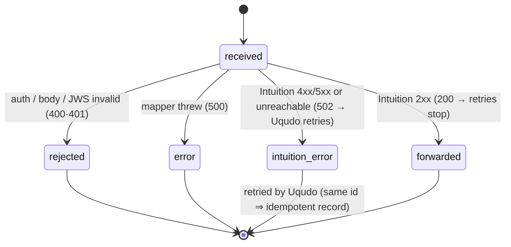

| Situation | Returned to Uqudo | Why |
|---|---|---|
| Mapped & forwarded OK | `200` | Done — stop retrying. |
| Bad/missing inbound secret, malformed body, invalid JWS | `400` / `401` | Retrying won't fix it. |
| Intuition rejected or unreachable | `502` | Transient — let Uqudo retry (5 min, up to 2 h). |

Idempotency makes the retry storm safe: a redelivered id is a no-op in every
durable driver, so retries can't double-count.

---

## 7. Module map

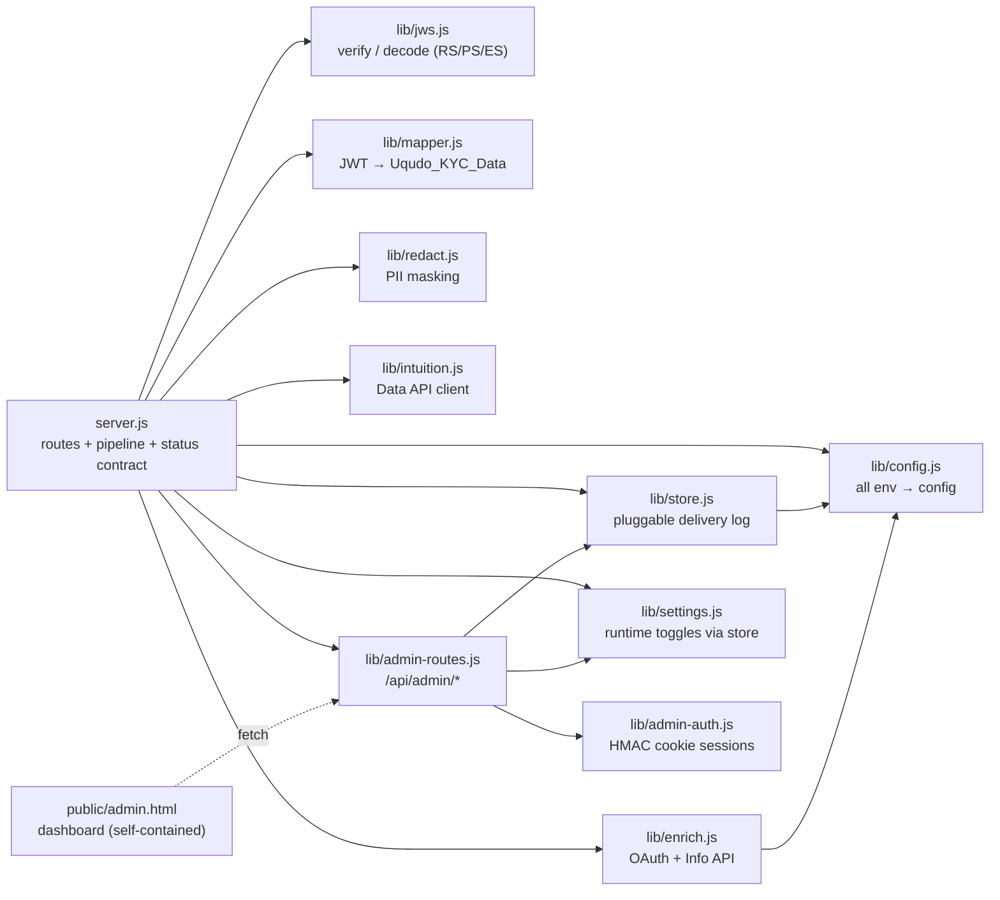

Single-responsibility per file; `server.js` owns only the pipeline order and the
status-code contract. Everything is dependency-light (express + helmet + the
chosen DB client) — no framework, no build step, one self-contained HTML page.

---

## 8. Delivery-log storage (pluggable) <a name="8-delivery-log-storage"></a>

One driver interface, five implementations. `lib/store.js` selects from
`LOG_STORE` (or infers it from whichever connection URL is set) and **falls back
to memory** if a durable store is misconfigured — dropping a KYC delivery to
protect a debug log would be the wrong trade; the dashboard shows which driver
is actually live.

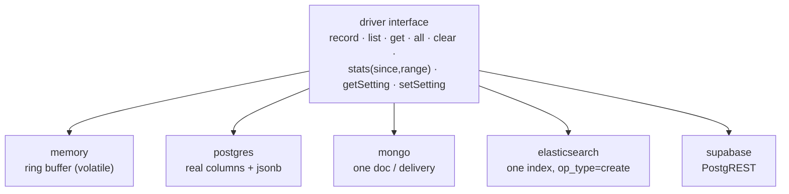

Guarantees shared by the durable drivers — each verified against a **real**
database in CI-style tests (`npm run test:pg | test:mongo | test:es`):

- **Auto-migration** — table / collection / index created on first write; no
  manual SQL step to forget.
- **Idempotent writes** — a webhook retry with the same id is a no-op
  (`ON CONFLICT DO NOTHING` / duplicate-key catch / `op_type=create`).
- **Injection-safe** filtering — bound parameters / structured queries only
  (there is a test that literally tries `'; DROP TABLE …`).
- **Time-range** filters (`since`) powering the 24 h / 7 d / 30 d views, with
  chart granularity chosen server-side (hourly vs daily buckets).

### Record shape (redacted)

Only non-identifying fields are stored by default; direct identifiers are
masked (`W••••••••1`), image blobs dropped. Illustrative document:

```json
{
  "id": "a3e89eebb55a",
  "at": "2026-07-19T13:01:22Z",
  "result": "forwarded",
  "verified": true,
  "verification_id": "0c0309ed-8304-403c-8a89-fca031dfb594",
  "customer_number": "784199912345678",
  "riskLevel": "Suspicious",
  "totalRulesScore": 170,
  "rulesTriggered": ["MA_DE", "MA_EM", "MA_PH", "PEP_SIMILAR"],
  "rulesDescriptions": ["Multiple Applications with same Device", "…"],
  "stages": { "verifyMs": 1, "enrichMs": 1325, "mapMs": 2, "forwardMs": 1839 },
  "authVia": "url-token",
  "durationMs": 3170,
  "payloads": { "jwt": "…", "document": "…", "intuitionResponse": "…" }
}
```

`payloads` exists only while the capture toggle is on, and even then the
masking layer (`lib/redact.js`) strips identifiers on **both** naming
conventions (camelCase JWT keys *and* snake_case document keys) and replaces
image blobs with `[image omitted: N chars]`.

---

## 9. Admin dashboard

A single self-contained HTML page (no CDNs — strict CSP) served at `/admin`,
talking to `/api/admin/*`.

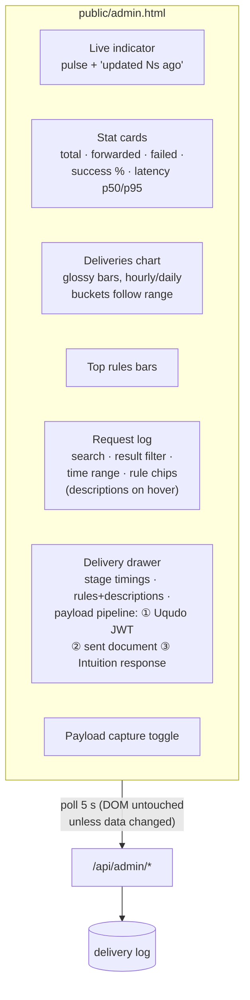

Design decisions worth knowing:

- **Auth**: password → HMAC-signed httpOnly cookie. No session store, so it
  works on serverless; fails **closed** (no `ADMIN_PASSWORD` = dashboard off).
- **Quiet polling**: responses are fingerprinted; the DOM re-renders only when
  data actually changed, and polling pauses while a drawer or dropdown is in
  use. The live pill still ticks every second so "calm" ≠ "dead".
- **One range selector** drives cards, chart buckets, top rules and the log
  together, computed server-side so all panels agree.

---

## 10. Runtime settings across instances <a name="10-runtime-settings"></a>

The payload-capture toggle must affect the instance that receives the *next
webhook*, which on serverless is almost never the instance that served the
dashboard click. So the setting lives in the store, not in process memory:

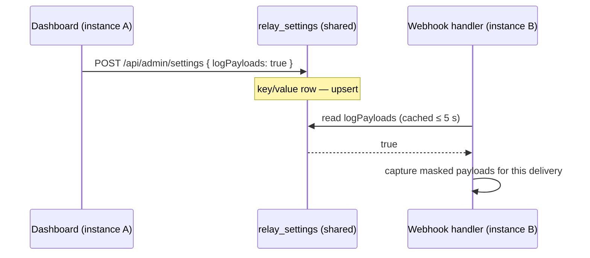

`LOG_PAYLOADS` (env) is only the *default*; the stored value overrides it. A
failed settings read falls back to the env default — a broken toggle must never
break a delivery.

---

## 11. Security model

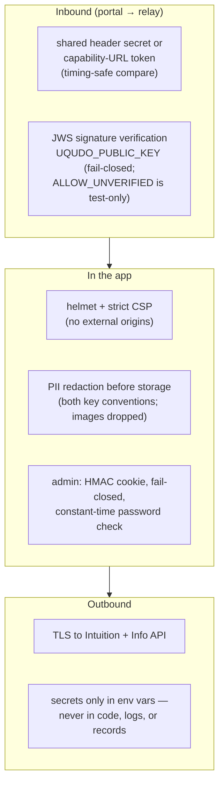

Fail-closed matrix:

| Missing configuration | Behaviour |
|---|---|
| `ADMIN_PASSWORD` | dashboard disabled entirely (not open) |
| `UQUDO_PUBLIC_KEY` and `ALLOW_UNVERIFIED` unset | webhook posts rejected |
| Durable store URL broken | soft-fallback to memory **with visible banner** (deliveries keep flowing) |
| Inbound secret unset | accepted but `/healthz` + dashboard warn "open" |

---

## 12. Deployment topology & HA <a name="12-deployment-topology"></a>

The app is stateless, so HA is "run N replicas behind a load balancer, all
sharing one database." A dead replica is skipped by the LB and restarted by the
orchestrator; no session or delivery state is lost because none lives in the app.

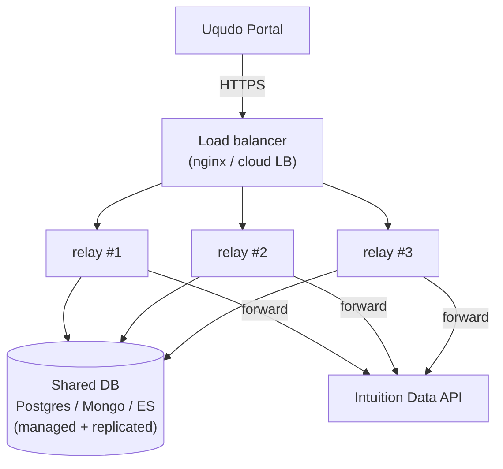

- **`deploy/docker-compose.ha.yml`** runs exactly this (nginx + N relay
  replicas + Postgres) on one host; `--scale relay=6` scales out.
- For production: cloud LB or Kubernetes (`Deployment` + `Service` + HPA,
  `/healthz` as probe), managed replicated datastore, shared
  `ADMIN_SESSION_SECRET` so logins work across replicas.
- On **Vercel** each invocation is its own instance — a durable store is
  mandatory (the memory log is per-instance and reads would be partial; this
  was measured, not theoretical).

| Concern | Handling |
|---|---|
| Statelessness | All state in the DB; replicas are interchangeable. |
| DB connections | Serverless keeps `PG_POOL_MAX=1` per instance and expects a **pooled** endpoint (pgbouncer / Neon pooled). |
| Idempotency | Same-id retries are no-ops, so Uqudo's retry storm can't double-count. |
| Health | `/healthz` gates LB traffic and restarts, and reports driver / verification / enrichment status. |
| Back-pressure | Bounded forward timeout; failures return `502` so Uqudo retries instead of the relay queueing. |
